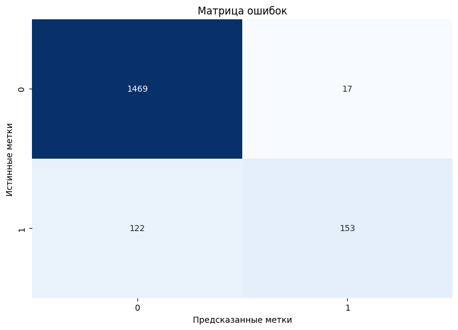

# Прогнозирование оттока клиентов

Целью проекта является создание модели прогнозирования — для идентификации клиентов, склонных к расторжению договора с телеком-оператором «ТелеДом».

**Особенности датасета:**
- **Два класса:** Лояльные клиенты / Ушедшие клиенты (отток).
- **Объем:** ~7,000 записей.
- **Дисбаланс классов:** Количество лояльных клиентов значительно превышает количество ушедших.
- **Источники:** Данные собраны из четырех таблиц, содержащих информацию о контрактах, персональных данных, интернет-услугах и телефонии.

## Технологический стек
- **Python**
- **Pandas & NumPy**: Для обработки и анализа данных.
- **Scikit-learn**: Основной фреймворк для построения пайплайнов, подбора гиперпараметров и оценки моделей.
- **CatBoost & LightGBM**: Библиотеки для реализации моделей градиентного бустинга.
- **Matplotlib & Seaborn**: Для визуализации данных и результатов.
- **SHAP**: Для интерпретации и анализа важности признаков модели.
- **Phik**: Для расширенного корреляционного анализа.

## Содержание проекта

### 1. Подготовка и анализ данных (EDA)
- **Объединение и очистка данных:** Четыре источника данных были объединены в единый датафрейм. Пропуски были обработаны как отдельная категория "Not connected", отражающая отсутствие услуги у клиента.
- **Исследовательский анализ:** Выявлены ключевые закономерности и составлен портрет типичного клиента.

### 2. Инжиниринг признаков
Для повышения качества модели и борьбы с мультиколлинеарностью были созданы новые признаки:
- `days_use`: Длительность пользования услугами (в днях).
- `count_services` и `count_streaming`: Агрегированные признаки, отражающие количество подключенных дополнительных интернет- и стриминговых услуг.
- Признаки с низкой информативностью или сильной корреляцией с другими (`gender`, `total_charges`) были удалены.

### 3. Разработка и обучение модели
Было протестировано несколько интерпретируемых моделей. Наилучшие результаты показала модель градиентного бустинга **CatBoostClassifier**.

**Ключевые особенности процесса:**
- **Пайплайны:** Весь процесс предобработки был выполнен в Pipeline.
- **Подбор гиперпараметров:** Оптимальные параметры для моделей были найдены с помощью `RandomizedSearchCV`.
- **Метрика:** В качестве основной метрики для оценки качества использовалась `ROC-AUC`, так как она устойчива к дисбалансу классов.

### 4. Анализ лучшей модели
Для анализа и интерпретации лучшей модели использовался фреймворк **SHAP**, который позволил определить вклад каждого признака в итоговый прогноз.

**Наиболее важные признаки:**
1.  **`days_use`**: Чем дольше клиент с компанией, тем ниже вероятность оттока.
2.  **`type`**: Клиенты с долгосрочными контрактами (на 1-2 года) наиболее лояльны.
3.  **`monthly_charges`**: Ежемесячный платеж.

## Результаты

Финальная модель **CatBoostClassifier** была оценена на тестовой выборке и показала следующие результаты:

- **Test ROC-AUC:** **0.926**
- **Test Accuracy:** **92.1%**

**Анализ по классам:**
| Класс | Precision | Recall | F1-Score |
|---|---|---|---|
| Лояльные | 0.92 | 0.99 | 0.95 |
| Отток | 0.90 | 0.56 | 0.69 |

**Матрица ошибок:**

**Выводы из результатов:**
- Модель достигла высокой общей точности и ROC-AUC, превысив целевой порог 0.88.
- **Recall 99%** для класса "Лояльные" говорит о том, что модель практически безошибочно определяет стабильных клиентов.
- **Recall 56%** для класса "Отток" означает, что модель находит чуть больше половины уходящих клиентов. Это основной компромисс: для повышения этого показателя можно снизить порог классификации, что, однако, приведет к увеличению числа ложных срабатываний (лояльных клиентов, помеченных как "в зоне риска").
